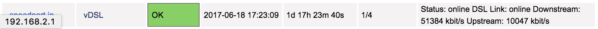

# check_speedport 

[](http://badge.fury.io/js/check_speedport)
[](https://gemnasium.com/github.com/hobbyquaker/check_speedport)
[](https://travis-ci.org/hobbyquaker/check_speedport)
[](https://github.com/sindresorhus/xo)
[![License][mit-badge]][mit-url]

> Nagios/Icinga Plugin to Check DSL Status of Speedport Routers

Tested with Speedport 921v, could/should work with other Speedports too.




## Install

`sudo npm install -g check_speedport`

## Nagios Config Example

``` 
define command {
    command_name	        check_speedport
    command_line            /usr/local/bin/check_speedport
}

define host {
    use                     generic-host            
    host_name               speedport.ip
    alias                   Speedport Telekom Router 
    address                 192.168.2.1 
}
define service {
    use                     generic-service
    host_name               speedport.ip
    service_description     vDSL 
    check_command           check_speedport 
}
```

## License

MIT © [Sebastian Raff](https://github.com/hobbyquaker)


[mit-badge]: https://img.shields.io/badge/License-MIT-blue.svg?style=flat
[mit-url]: LICENSE
